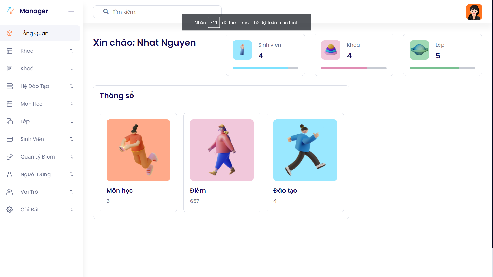

# Laravel Students Manager System

A free REST API program for hotel reservation, powered by Laravel. This project is designed to work similarly to the hotel reservation section on www.alibaba.ir

### This project uses the following packages:

    horizon
    telescope
    flysystem-aws
    phpspreadsheet
    spatie-medialibrary
    scrib
    laravel/sanctum
    laravel/scout
    meilisearch-php
    predis

### Installation

    Navigate to the project directory:
    cd project

    Install dependencies:
    composer install

    Set up environment variables:
    cp .env.example .env and configure your environment variables in the .env file

    Generate a key:
    php artisan key:generate

    Run the migrations and seed:
    php artisan migrate --seed

    Start the development server:
    php artisan serve
